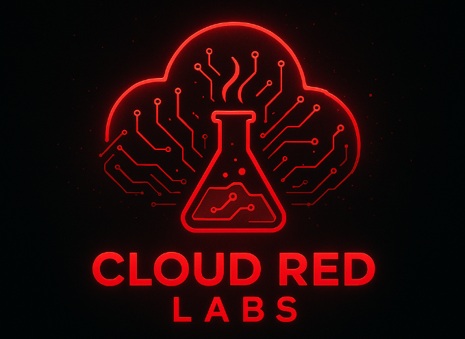
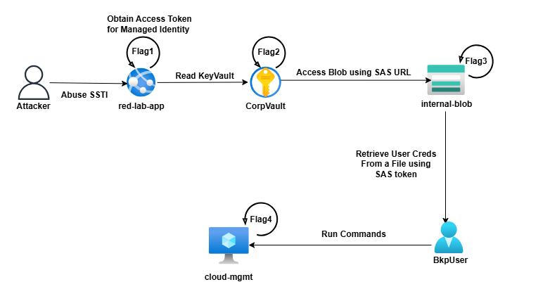
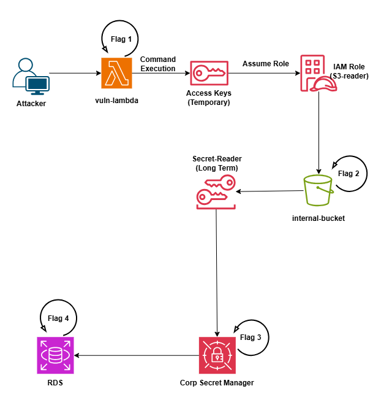

# Cloud-Red-Labs
<p align="center">
  
</p>

<p align="center">
  
  
  
  
  <a href="https://github.com/gr33nm0nk2802/Cloud-Red-Labs"></a>
  <a href="https://github.com/gr33nm0nk2802/Cloud-Red-Labs/blob/main/LICENSE"></a>
  <a href="https://github.com/gr33nm0nk2802/Cloud-Red-Labs/pulls"></a>
  <a href="https://www.python.org/"></a>
</p>

<p align="center">
  <!-- Infra tooling badges -->
  <a href="https://www.terraform.io/"></a>
  <a href="https://docs.aws.amazon.com/cli/"></a>
  <a href="https://learn.microsoft.com/cli/azure/"></a>
</p>

<p align="center">
  Built with ❤️ by <a href="https://linkedin.com/in/gr33nm0nk2802" target="_blank" rel="noopener noreferrer">@gr33nm0nk2802</a><br><br>
  <strong>Cloud-Red-Labs</strong> — intentionally vulnerable cloud Red Team lab environment for learning and practicing common AWS &amp; Azure security flaws, exploitation techniques, and cloud-based Red Team operations. 
</p>

> Future editions will support other cloud providers.

# Red Teaming Lifecycle

- Recon                     
- Initial Access            
- Privilege Escalation      
- Lateral Movement          
- Persistence               
- Exfiltration              

# Pre-Requisites 

## To deploy the lab
1. AWS Account with Administrative Access (To deploy the AWS labs)
2. Azure Account with Administrative Access (To deploy the Azure labs)
3. Terraform must be installed.
4. mysql must be installed for deploying the AWS challenge.

> Note: Run the commands from a linux terminal since, it has been tested. For windows users having a quick WSL access helps.

## To solve the challenge lab
1. PowerShell/Bash
2. Curl
4. azcli
5. awscli
6. mysql
7. python

> Note: Attacks are possible from Windows/MAC/Linux as long as you have the above installed.

# Deployment
## Build the Application

1. If you make changes to the application code under `artifacts/src`. Run the following.

```bash
cd artifacts
chmod +x build.sh
./build.sh
```

## How to Deploy the lab?

1. Clone the repo and navigate to the specific repository

```bash
git clone [RepoUrl]
cd cloud-red-lab
```

2. To deploy Azure challenge. 

Login to the `azcli` from your console.

```bash
cd azure/

az login --tenant $TENANT_ID --use-device-code --scope https://management.core.windows.net/.default
# az login --tenant $TENANT_ID --use-device-code --scope https://graph.microsoft.com/.default

terraform init
terraform apply --auto-approve
```

3. To deploy the AWS challenge.

Login to `awscli`

```bash
cd aws/

aws configure

terraform init
terraform apply --auto-approve
```

4. To destroy the AWS or Azure lab, navigate to the respective directory and run.

```bash
terraform destroy --auto-approve
```

## Azure Lab



## Scenarios

## Solution 

[Available here](./azure/Solution.md)

## AWS Lab


## Scenarios

## Solution 

[Available here](./aws/Solution.md)


